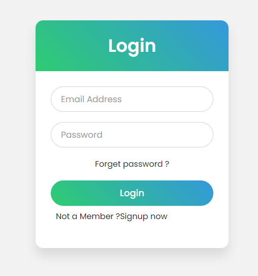

# Login Page Project Readme

This project consists of a simple login page implemented using HTML and CSS. The login page is designed to be responsive and visually appealing. Below are the details of the project structure and styling.

## Project Structure

The project contains two main files: `index.html` and `style.css`.

### index.html

The HTML file defines the structure of the login page. It includes a form with fields for email address and password, a "Forgot password?" link, a login button, and a "Not a Member?" signup link.

### style.css

The CSS file provides styling for the HTML elements. It defines the layout, colors, fonts, and animations used in the login page. The styling is done using the Poppins font from Google Fonts, and the overall design is clean and modern.

## Styling Details

### Fonts

The project uses the following Google Fonts:
- Abril Fatface
- Merriweather
- Open Sans
- Poppins
- Space Mono
- Work Sans

### Box Model

The CSS includes a general reset for the box model, setting margin and padding to zero and using `box-sizing: border-box` to include borders and padding in the element's total width and height.

### Page Layout

The login page is centered on the screen both horizontally and vertically using flexbox. The background is set to a light gray color (#f2f2f2).

### Form Styling

The form is contained within a wrapper div with a width of 380px. The form elements have a clean design with rounded corners and subtle animations. The input fields have a border that changes color on focus, and the labels transition smoothly above the input fields when they are in focus or have content.

### Button Styling

The "Login" button has a gradient background that changes on hover and click, providing a visual indication of interactivity.

### Links

The "Forgot password?" and "Not a Member?" links have consistent styling, and their colors change on hover.

### Preview 

## How to Use

To use this login page in your project, follow these steps:

1. Copy the contents of `index.html` and `style.css` into your respective HTML and CSS files.
2. Adjust the form action attribute and href values in the HTML file to match your authentication and signup endpoints.
3. Customize the styles, fonts, and colors as needed for your project.

Feel free to enhance and modify the code

Happy coding!